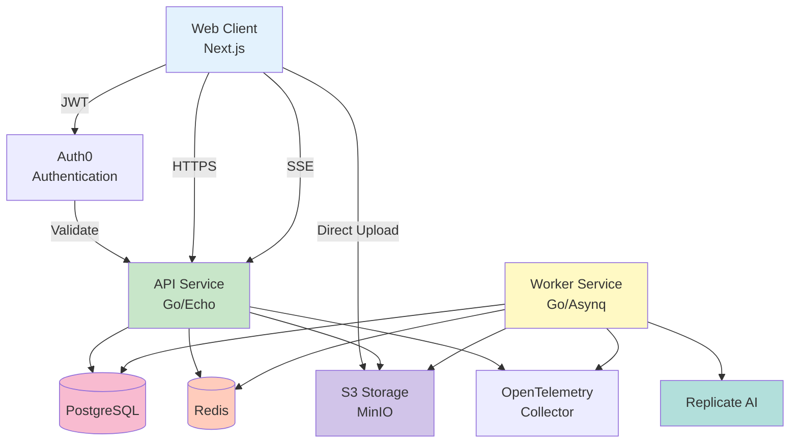
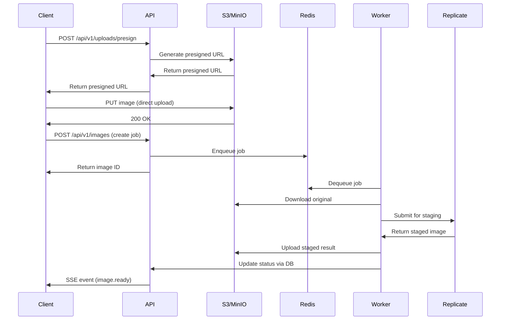
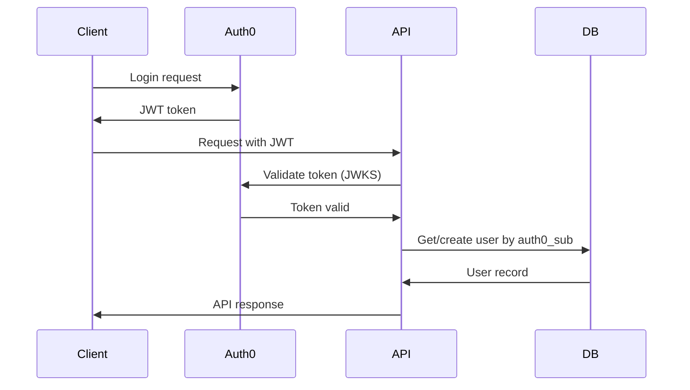

# Architecture Overview

Real Staging AI is designed as a modern, scalable microservices architecture optimized for AI-powered image processing workloads.

## High-Level Architecture



## System Components

### Web Client (Next.js)

Modern React-based frontend application providing the user interface.

**Technology:** Next.js 14, TypeScript, Tailwind CSS, shadcn/ui

**Key Features:**
- Server-side rendering for performance
- Real-time updates via Server-Sent Events
- Responsive design with dark mode
- Optimized image handling

**Port:** 3000 (development)

---

### API Service (Go)

RESTful HTTP API handling authentication, project management, and orchestration.

**Technology:** Go 1.22+, Echo framework, pgx, OpenTelemetry

**Responsibilities:**
- User authentication and authorization (Auth0/JWT)
- Project and image CRUD operations
- S3 presigned URL generation
- Job queue management
- Server-Sent Events for real-time updates
- Stripe webhook handling
- Billing and subscription management

**Port:** 8080

[Learn more →](api-service.md)

---

### Worker Service (Go)

Background job processor for AI image staging operations.

**Technology:** Go 1.22+, Asynq, Replicate SDK

**Responsibilities:**
- Job queue consumption from Redis
- Image download from S3
- AI model invocation (Replicate)
- Staged image upload to S3
- Status updates and notifications
- Error handling and retries

[Learn more →](worker-service.md)

---

### PostgreSQL Database

Primary relational database for application state.

**Version:** PostgreSQL 17

**Key Tables:**
- `users` - User accounts and Auth0 mapping
- `projects` - User projects
- `images` - Image metadata and status
- `jobs` - Background job tracking
- `subscriptions` - Stripe subscription state
- `invoices` - Billing history
- `processed_events` - Webhook idempotency

**Port:** 5432

[Learn more →](database.md)

---

### Redis

In-memory data store for job queue and pub/sub.

**Version:** Redis 8.2

**Use Cases:**
- Job queue (via Asynq)
- Server-Sent Events pub/sub
- Caching (future)
- Rate limiting (future)

**Port:** 6379

---

### MinIO / S3

S3-compatible object storage for images.

**Storage Structure:**
```
real-staging/
├── uploads/          # Original images
│   └── user_{id}/
│       └── {uuid}.{ext}
└── staged/           # Processed images
    └── user_{id}/
        └── {uuid}.{ext}
```

**Ports:** 9000 (API), 9001 (Console)

---

### Replicate AI

Third-party AI platform for image processing.

**Models:**
- `qwen/qwen-image-edit` - Primary staging model (~9s, ~$0.011/image)
- `black-forest-labs/flux-kontext-max` - High-quality alternative

**Integration:** REST API with webhook callbacks

---

### OpenTelemetry Collector

Centralized telemetry collection and export.

**Signals:**
- **Traces** - Request flow and performance
- **Metrics** - System health and usage
- **Logs** - Structured application logs

**Ports:** 4317 (gRPC), 4318 (HTTP)

---

## Data Flow

### Image Staging Workflow



### Authentication Flow



## Scalability & Resilience

### Horizontal Scaling

- **API Service**: Stateless, scale horizontally behind load balancer
- **Worker Service**: Scale workers to match job throughput
- **Database**: Read replicas for query scaling
- **Redis**: Cluster mode for high availability

### Fault Tolerance

- **Job Retries**: Automatic retry with exponential backoff
- **Dead Letter Queue**: Failed jobs captured for analysis
- **Health Checks**: Kubernetes/Docker readiness and liveness probes
- **Circuit Breakers**: Protect against cascading failures

### Performance Optimization

- **Connection Pooling**: pgx pool for database connections
- **Presigned URLs**: Direct client-to-S3 uploads avoid API bottleneck
- **Async Processing**: Non-blocking job queue architecture
- **SSE vs Polling**: Efficient real-time updates

## Security Architecture

### Authentication & Authorization

- **OAuth 2.0 / OIDC**: Industry-standard auth via Auth0
- **JWT Tokens**: Stateless authentication with RS256 signing
- **User Isolation**: Row-level security via user_id foreign keys

### Data Security

- **Encryption in Transit**: TLS/HTTPS for all external communication
- **Encryption at Rest**: S3 server-side encryption
- **Presigned URLs**: Time-limited, scoped access to S3 objects
- **Webhook Signatures**: HMAC verification for Stripe webhooks

### Infrastructure Security

- **Environment Isolation**: Separate dev/staging/prod configs
- **Secrets Management**: Never commit secrets, use .env or vault
- **Minimal Permissions**: Principle of least privilege
- **Input Validation**: Strict validation on all API inputs

## Observability

### Tracing

OpenTelemetry distributed tracing tracks requests across services:

- HTTP request → API handler → DB query → Redis operation
- Worker job → S3 download → Replicate API → S3 upload

### Metrics

Key metrics tracked:

- Request rate, latency, error rate (RED)
- Job processing time and throughput
- Database connection pool usage
- S3 operation latency

### Logging

Structured JSON logging with correlation IDs:

```json
{
  "level": "info",
  "timestamp": "2025-10-12T20:10:00Z",
  "service": "api",
  "trace_id": "abc123",
  "user_id": "user_xyz",
  "message": "Image created",
  "image_id": "img_123"
}
```

## Technology Decisions

### Why Go?

- Excellent performance for I/O-bound workloads
- Native concurrency with goroutines
- Strong typing and compile-time safety
- Rich ecosystem for cloud-native services

### Why Echo Framework?

- Lightweight and performant
- Middleware support
- Built-in validation
- Easy OpenTelemetry integration

### Why Asynq for Jobs?

- Redis-backed reliability
- Automatic retries with exponential backoff
- Priority queues and task scheduling
- Web UI for monitoring

### Why PostgreSQL?

- ACID compliance for financial data (billing)
- JSON support for flexible schemas
- Mature ecosystem and tooling
- Excellent performance at scale

### Why Replicate?

- Pay-per-use pricing
- No GPU infrastructure management
- Multiple model options
- Fast inference times

---

**Next Steps:**

- [API Service Details →](api-service.md)
- [Worker Service Details →](worker-service.md)
- [Database Schema →](database.md)
- [Tech Stack Decisions →](tech-stack.md)
