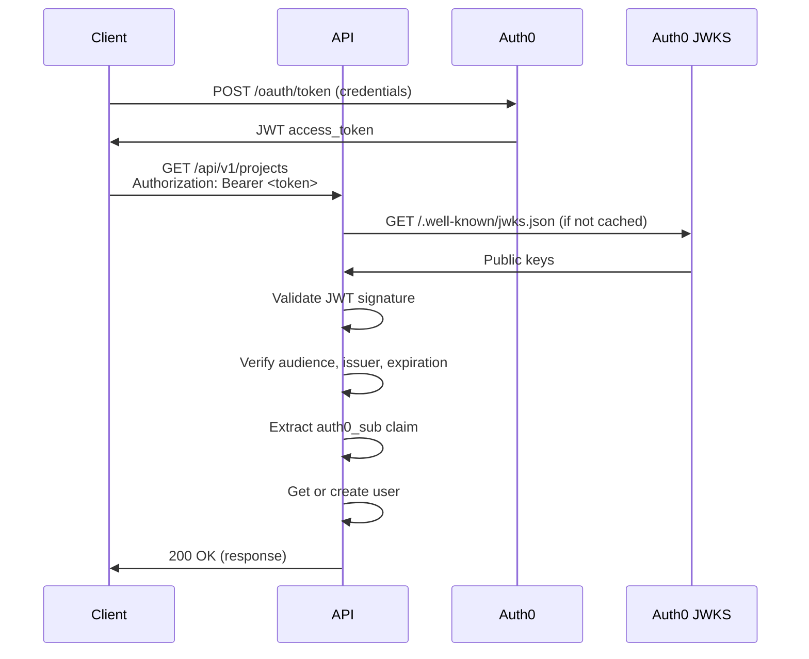

# Authentication Guide

Real Staging AI uses Auth0 for secure authentication with OAuth 2.0 and OpenID Connect (OIDC).

## Overview

The authentication flow:

1. User authenticates with Auth0
2. Auth0 returns a JWT access token
3. Client includes token in `Authorization: Bearer <token>` header
4. API validates token using Auth0's public key (JWKS)
5. API extracts user identity from token claims
6. User record auto-created on first request

## Prerequisites

- Auth0 account (free tier available at [auth0.com](https://auth0.com))
- Understanding of JWT and OAuth 2.0 concepts

## Setting Up Auth0

### Step 1: Create Auth0 API

1. Log in to your [Auth0 Dashboard](https://manage.auth0.com/)
2. Navigate to **Applications → APIs**
3. Click **+ Create API**
4. Configure:
   - **Name**: `Real Staging API`
   - **Identifier**: `https://api.realstaging.local` (this is the audience)
   - **Signing Algorithm**: `RS256`
5. Click **Create**

!!! note "API Identifier"
    The identifier (audience) must match the `AUTH0_AUDIENCE` environment variable in your API configuration.

### Step 2: Create Application

1. Navigate to **Applications → Applications**
2. Click **+ Create Application**
3. Configure:
   - **Name**: `Real Staging Web App`
   - **Application Type**: **Single Page Web Applications**
4. Click **Create**

### Step 3: Configure Application Settings

In your application settings:

**Application URIs:**
```
Allowed Callback URLs:
http://localhost:3000/api/auth/callback

Allowed Logout URLs:
http://localhost:3000

Allowed Web Origins:
http://localhost:3000
```

**Advanced Settings → Grant Types:**
- ✅ Authorization Code
- ✅ Refresh Token

Save changes.

### Step 4: Get Credentials

From your application's **Settings** tab, copy:

- **Domain** (e.g., `dev-abc123.us.auth0.com`)
- **Client ID**
- **Client Secret**

## Configuration

### API Configuration

Create or edit `apps/api/secrets.yml`:

```yaml
auth0:
  domain: "dev-abc123.us.auth0.com"
  audience: "https://api.realstaging.local"
```

### Frontend Configuration

Create or edit `apps/web/.env.local`:

```env
AUTH0_SECRET='your-secret-here'
AUTH0_BASE_URL='http://localhost:3000'
AUTH0_ISSUER_BASE_URL='https://dev-abc123.us.auth0.com'
AUTH0_CLIENT_ID='your-client-id'
AUTH0_CLIENT_SECRET='your-client-secret'
AUTH0_AUDIENCE='https://api.realstaging.local'
```

!!! warning "Never Commit Secrets"
    Always use `.env.local` (gitignored) for local secrets. Never commit credentials to version control.

## Generating Test Tokens

### Method 1: Auth0 Dashboard (Quickest)

1. Go to **Applications → APIs**
2. Select your API
3. Click the **Test** tab
4. Copy the test token from the **Response** section

### Method 2: Using curl

```bash
curl --request POST \
  --url https://YOUR_DOMAIN.auth0.com/oauth/token \
  --header 'content-type: application/json' \
  --data '{
    "client_id": "YOUR_CLIENT_ID",
    "client_secret": "YOUR_CLIENT_SECRET",
    "audience": "https://api.realstaging.local",
    "grant_type": "client_credentials"
  }'
```

Response:
```json
{
  "access_token": "eyJhbGciOiJSUzI1NiIsInR5cCI6IkpXVCIsImtpZCI6Ij...",
  "token_type": "Bearer",
  "expires_in": 86400
}
```

### Method 3: Using Go Helper

The repository includes a token generation helper:

```bash
make token
```

This runs `apps/api/cmd/token/main.go` which reads from your secrets file and generates a token.

**Source code:**
```go
package main

import (
  "bytes"
  "encoding/json"
  "fmt"
  "io"
  "net/http"
  "os"
)

func main() {
  domain := os.Getenv("AUTH0_DOMAIN")
  url := fmt.Sprintf("https://%s/oauth/token", domain)

  payload := map[string]string{
    "client_id":     os.Getenv("AUTH0_CLIENT_ID"),
    "client_secret": os.Getenv("AUTH0_CLIENT_SECRET"),
    "audience":      os.Getenv("AUTH0_AUDIENCE"),
    "grant_type":    "client_credentials",
  }
  
  b, _ := json.Marshal(payload)
  req, _ := http.NewRequest("POST", url, bytes.NewBuffer(b))
  req.Header.Set("content-type", "application/json")

  res, _ := http.DefaultClient.Do(req)
  defer res.Body.Close()
  io.Copy(os.Stdout, res.Body)
}
```

### Method 4: Auth0 CLI

```bash
# Install Auth0 CLI
brew install auth0

# Login
auth0 login

# Generate token
auth0 test token --audience https://api.realstaging.local
```

## Using Tokens

### With curl

```bash
export TOKEN="your-access-token-here"

curl http://localhost:8080/api/v1/projects \
  -H "Authorization: Bearer $TOKEN"
```

### With Go

```go
package main

import (
  "net/http"
)

func main() {
  url := "http://localhost:8080/api/v1/projects"
  req, _ := http.NewRequest("GET", url, nil)
  req.Header.Add("Authorization", "Bearer YOUR_TOKEN")
  
  res, _ := http.DefaultClient.Do(req)
  // Handle response...
}
```

### With JavaScript/TypeScript

```typescript
const response = await fetch('http://localhost:8080/api/v1/projects', {
  headers: {
    'Authorization': `Bearer ${accessToken}`
  }
});
```

## Token Validation Flow



## JWT Token Structure

A decoded Real Staging AI JWT contains:

**Header:**
```json
{
  "alg": "RS256",
  "typ": "JWT",
  "kid": "abc123..."
}
```

**Payload:**
```json
{
  "iss": "https://dev-abc123.us.auth0.com/",
  "sub": "auth0|65f8a9b1c2d3e4f5g6h7i8j9",
  "aud": "https://api.realstaging.local",
  "iat": 1730000000,
  "exp": 1730086400,
  "scope": "openid profile email"
}
```

**Key Claims:**
- `iss` - Issuer (Auth0 domain)
- `sub` - Subject (unique user identifier)
- `aud` - Audience (API identifier)
- `exp` - Expiration timestamp
- `iat` - Issued at timestamp

## API Middleware

The API validates tokens using Echo middleware:

```go
// Simplified example
func JWTMiddleware(domain, audience string) echo.MiddlewareFunc {
  return func(next echo.HandlerFunc) echo.HandlerFunc {
    return func(c echo.Context) error {
      token := extractToken(c.Request())
      if token == "" {
        return echo.NewHTTPError(http.StatusUnauthorized, "missing token")
      }
      
      // Validate token with Auth0 public key
      claims, err := validateToken(token, domain, audience)
      if err != nil {
        return echo.NewHTTPError(http.StatusUnauthorized, "invalid token")
      }
      
      // Store user context
      c.Set("auth0_sub", claims.Subject)
      return next(c)
    }
  }
}
```

## User Auto-Creation

When a valid token is received, the API automatically creates a user if they don't exist:

1. Extract `sub` claim from JWT (e.g., `auth0|65f8a9b1...`)
2. Query database for user with matching `auth0_sub`
3. If not found, insert new user record
4. Return user ID for subsequent operations

```sql
INSERT INTO users (id, auth0_sub, role, created_at)
VALUES (gen_random_uuid(), $1, 'user', NOW())
ON CONFLICT (auth0_sub) DO NOTHING
RETURNING id;
```

## Troubleshooting

### 401 Unauthorized

**Symptoms:** API returns `401 Unauthorized` for all requests

**Causes:**
- Missing or malformed `Authorization` header
- Expired token
- Invalid signature
- Wrong audience or issuer

**Solutions:**
```bash
# Verify token is set
echo $TOKEN

# Generate new token
make token

# Check token expiration
jwt decode $TOKEN | jq .exp
```

### Invalid Audience

**Symptoms:** Token validation fails with audience mismatch

**Solution:**
- Verify `AUTH0_AUDIENCE` in `secrets.yml` matches Auth0 API identifier
- Ensure token was requested with correct audience

### JWKS Cache Issues

**Symptoms:** Token validation intermittently fails

**Solution:**
- API caches JWKS keys with 24h TTL
- Restart API to refresh cache
- Check Auth0 key rotation schedule

### Token Expired

**Symptoms:** `401` error with "token expired" message

**Solution:**
```bash
# Tokens typically expire after 24 hours
# Generate new token
export TOKEN=$(make token | jq -r .access_token)
```

## Security Best Practices

✅ **Do:**
- Use environment variables for secrets
- Validate tokens on every protected endpoint
- Check token expiration
- Verify audience and issuer
- Use HTTPS in production
- Rotate secrets regularly

❌ **Don't:**
- Hardcode credentials
- Commit secrets to git
- Share tokens publicly
- Use weak client secrets
- Disable signature validation
- Trust tokens without verification

## Production Considerations

### Environment Variables

```env
# Production
AUTH0_DOMAIN=prod-company.us.auth0.com
AUTH0_AUDIENCE=https://api.real-staging.ai
AUTH0_CLIENT_ID=<production-client-id>
AUTH0_CLIENT_SECRET=<production-secret>
```

### HTTPS Required

Always use HTTPS in production:
- Auth0 callbacks require HTTPS
- JWTs should only be sent over secure connections
- Configure proper SSL/TLS certificates

### Token Rotation

- Tokens expire after 24 hours by default
- Implement refresh token flow for long-lived sessions
- Monitor Auth0 key rotation events

### Rate Limiting

Auth0 has rate limits:
- Free tier: 7,000 tokens/month
- Paid plans: Higher limits
- Implement token caching on client side

## Testing Authentication

### Unit Tests

Mock JWT validation in tests:

```go
func TestHandlerWithAuth(t *testing.T) {
  e := echo.New()
  req := httptest.NewRequest(http.MethodGet, "/", nil)
  rec := httptest.NewRecorder()
  c := e.NewContext(req, rec)
  
  // Mock authenticated user
  c.Set("auth0_sub", "auth0|test-user-123")
  
  // Call handler
  handler(c)
  
  // Assertions...
}
```

### Integration Tests

Use real or test Auth0 tokens:

```go
func TestIntegration(t *testing.T) {
  token := getTestToken() // Helper to get token
  
  req, _ := http.NewRequest("GET", "/api/v1/projects", nil)
  req.Header.Set("Authorization", "Bearer "+token)
  
  // Make request and assert
}
```

---

**Related Documentation:**

- [Configuration Guide](configuration.md)
- [API Reference](../api-reference/)
- [Security](../security/)
