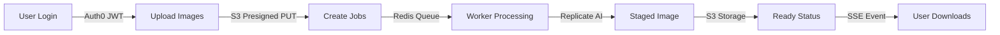

# Real Staging AI Documentation

<div class="hero-section">
  <h1>Professional AI-Powered Virtual Staging</h1>
  <p>Transform empty real estate spaces into beautifully furnished rooms in seconds</p>
</div>

## Overview

Real Staging AI is a DIY virtual staging SaaS platform for real estate professionals. Upload room photos and receive AI-staged images using Replicate's advanced image editing models. Built for production with fast time-to-market and enterprise-grade reliability.

### Key Features

<div style="display: grid; grid-template-columns: repeat(auto-fit, minmax(250px, 1fr)); gap: 1.5rem; margin: 2rem 0;">
  <div class="feature-card">
    <h3>⚡ Lightning Fast</h3>
    <p>Process images in ~9 seconds with Replicate's optimized AI models</p>
  </div>
  <div class="feature-card">
    <h3>📦 Batch Processing</h3>
    <p>Upload up to 50 images at once with customizable room types and styles</p>
  </div>
  <div class="feature-card">
    <h3>🔐 Enterprise Auth</h3>
    <p>Secure authentication via Auth0 with OIDC/JWT standards</p>
  </div>
  <div class="feature-card">
    <h3>💳 Integrated Billing</h3>
    <p>Stripe-powered subscriptions and pay-per-image billing</p>
  </div>
  <div class="feature-card">
    <h3>📊 Real-time Updates</h3>
    <p>Server-Sent Events (SSE) for live processing status</p>
  </div>
  <div class="feature-card">
    <h3>🛡️ Production Ready</h3>
    <p>Full observability with OpenTelemetry, comprehensive testing</p>
  </div>
</div>

## Tech Stack

**Backend/API**  
Go (Echo framework), PostgreSQL (pgx), Redis (asynq), S3-compatible storage, Stripe, Auth0, OpenTelemetry

**Frontend**  
Next.js, Tailwind CSS, shadcn/ui components

**AI Staging**  
Replicate API (qwen/qwen-image-edit) - ~9s per image, ~$0.011/image

**Infrastructure**  
Docker Compose (development), GitHub Actions (CI/CD), deployable to Fly.io, Render, or any container platform

## How It Works



1. **Authentication**: User logs in via Auth0 → frontend receives JWT token
2. **Upload**: Original images uploaded via S3 presigned PUT URLs
   - Supports single or batch upload (up to 50 images)
   - Configure room type and style per image or use defaults
3. **Job Creation**: Image jobs enqueued to Redis (asynq)
4. **Processing**: Worker downloads original from S3, sends to Replicate AI, uploads result
5. **Completion**: API marks image ready → client receives SSE event with download URL

## Quick Links

<div style="display: grid; grid-template-columns: repeat(auto-fit, minmax(200px, 1fr)); gap: 1rem; margin: 2rem 0;">
  <a href="getting-started/" class="md-button md-button--primary" style="text-align: center;">Get Started →</a>
  <a href="architecture/" class="md-button" style="text-align: center;">Architecture</a>
  <a href="guides/" class="md-button" style="text-align: center;">Guides</a>
  <a href="api-reference/" class="md-button" style="text-align: center;">API Reference</a>
</div>

## Monorepo Structure

```
real-staging-ai/
├── apps/
│   ├── api/          # Go HTTP API (Echo)
│   ├── worker/       # Background worker (asynq)
│   ├── web/          # Next.js frontend
│   └── docs/         # This documentation site
├── infra/
│   └── migrations/   # SQL schema migrations
└── config/           # Environment configs
```

## Key Resources

- **Live App**: [real-staging.ai](https://real-staging.ai)
- **API Docs**: [OpenAPI Specification](https://jasonkradams.github.io/real-staging-ai/)
- **Source Code**: [GitHub Repository](https://github.com/jasonkradams/real-staging-ai)

## Getting Help

- Read the [Getting Started Guide](getting-started/)
- Check the [Guides](guides/) for specific topics
- Review [Architecture Documentation](architecture/) for system design
- See [Contributing Guidelines](development/contributing/) to get involved

---

**Ready to dive in?** Start with the [Installation Guide](getting-started/installation/) to set up your development environment.
