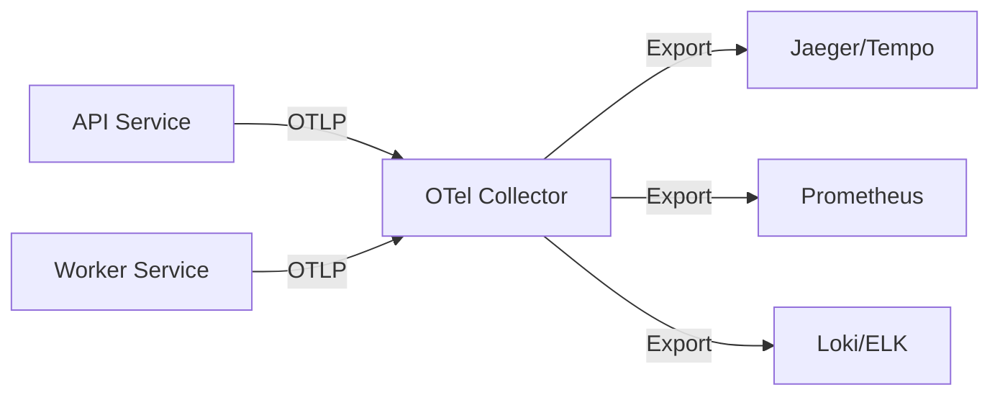

# Monitoring & Observability

Real Staging AI is fully instrumented with OpenTelemetry for comprehensive observability.

## Overview

The platform exports three types of telemetry data:

- **Traces** - Request flow and performance across services
- **Metrics** - System health and business KPIs
- **Logs** - Structured application events

## OpenTelemetry Setup

### Architecture



### Configuration

OpenTelemetry Collector config (`infra/otelcol.yaml`):

```yaml
receivers:
  otlp:
    protocols:
      grpc:
        endpoint: 0.0.0.0:4317
      http:
        endpoint: 0.0.0.0:4318

processors:
  batch:
    timeout: 10s
    send_batch_size: 1024

exporters:
  prometheus:
    endpoint: "0.0.0.0:8889"
  jaeger:
    endpoint: "jaeger:14250"
    tls:
      insecure: true
  loki:
    endpoint: "http://loki:3100/loki/api/v1/push"

service:
  pipelines:
    traces:
      receivers: [otlp]
      processors: [batch]
      exporters: [jaeger]
    metrics:
      receivers: [otlp]
      processors: [batch]
      exporters: [prometheus]
    logs:
      receivers: [otlp]
      processors: [batch]
      exporters: [loki]
```

## Distributed Tracing

### Key Traces

**API Request Flow:**
```
HTTP Request
├── JWT Validation
├── Database Query (get user)
├── S3 Presign Operation
└── Redis Enqueue
```

**Worker Job Processing:**
```
Job Dequeue
├── Database Update (status = processing)
├── S3 Download (original image)
├── Replicate API Call
│   └── AI Model Inference
├── S3 Upload (staged image)
└── Database Update (status = ready)
```

### Viewing Traces

With Jaeger (development):

```bash
# Start Jaeger
docker run -d --name jaeger \
  -p 16686:16686 \
  -p 14250:14250 \
  jaegertracing/all-in-one:latest

# Open UI
open http://localhost:16686
```

### Trace Attributes

All traces include:

| Attribute | Description | Example |
|-----------|-------------|---------|
| `service.name` | Service identifier | `real-staging-api` |
| `trace.id` | Unique trace ID | `a1b2c3d4...` |
| `span.kind` | Span type | `SERVER`, `CLIENT` |
| `http.method` | HTTP method | `POST` |
| `http.status_code` | Response code | `200` |
| `db.system` | Database type | `postgresql` |
| `user.id` | User identifier | `user_abc123` |

## Metrics

### Application Metrics

**API Service:**
- `http_requests_total` - Request count by endpoint, method, status
- `http_request_duration_seconds` - Request latency histogram
- `jwt_validation_failures_total` - Authentication failures
- `s3_presign_operations_total` - Presigned URL generations
- `redis_enqueue_operations_total` - Jobs enqueued

**Worker Service:**
- `jobs_processed_total` - Jobs completed by status
- `job_processing_duration_seconds` - Job duration histogram
- `replicate_api_calls_total` - AI API calls
- `s3_operations_total` - S3 uploads/downloads
- `image_processing_errors_total` - Errors by type

**Infrastructure:**
- `go_goroutines` - Active goroutines
- `go_memstats_alloc_bytes` - Memory allocation
- `process_cpu_seconds_total` - CPU usage

### Viewing Metrics

With Prometheus:

```bash
# Start Prometheus
docker run -d --name prometheus \
  -p 9090:9090 \
  -v $(pwd)/prometheus.yml:/etc/prometheus/prometheus.yml \
  prom/prometheus

# Open UI
open http://localhost:9090
```

### Example Queries

```promql
# Request rate (per second)
rate(http_requests_total[5m])

# P95 latency
histogram_quantile(0.95, rate(http_request_duration_seconds_bucket[5m]))

# Error rate
rate(http_requests_total{status=~"5.."}[5m])

# Job processing throughput
rate(jobs_processed_total{status="completed"}[5m])

# Average job duration
rate(job_processing_duration_seconds_sum[5m]) / rate(job_processing_duration_seconds_count[5m])
```

## Structured Logging

### Log Format

All logs use structured JSON:

```json
{
  "timestamp": "2025-10-12T20:30:00Z",
  "level": "info",
  "service": "api",
  "trace_id": "abc123",
  "span_id": "def456",
  "user_id": "user_xyz",
  "message": "Image created successfully",
  "image_id": "img_123",
  "project_id": "proj_456",
  "duration_ms": 45
}
```

### Log Levels

| Level | Usage | Example |
|-------|-------|---------|
| `debug` | Detailed debugging info | Parameter values, state changes |
| `info` | Normal operations | Request received, job completed |
| `warn` | Recoverable issues | Retry attempt, deprecated usage |
| `error` | Errors requiring attention | API failures, database errors |
| `fatal` | Critical failures | Service cannot start |

### Viewing Logs

**Development:**
```bash
# View all logs
docker compose logs -f

# Filter by service
docker compose logs -f api
docker compose logs -f worker

# Search logs
docker compose logs | grep ERROR
```

**Production (with Loki):**
```bash
# Query logs
logcli query '{service="api"}' --limit=100

# Filter by level
logcli query '{service="api", level="error"}'

# Search in message
logcli query '{service="api"} |= "Image created"'
```

## Dashboards

### Grafana Dashboard

Create a dashboard to visualize key metrics:

**Panels:**
1. **Request Rate** - Requests per second
2. **Response Time** - P50, P95, P99 latencies
3. **Error Rate** - 4xx and 5xx errors
4. **Job Queue Length** - Pending jobs in Redis
5. **Job Processing Time** - Worker performance
6. **Database Connections** - Pool usage
7. **Memory Usage** - Heap allocation
8. **Goroutines** - Concurrency monitoring

### Example Dashboard JSON

```json
{
  "dashboard": {
    "title": "Real Staging AI",
    "panels": [
      {
        "title": "Request Rate",
        "targets": [{
          "expr": "rate(http_requests_total[5m])"
        }]
      },
      {
        "title": "P95 Latency",
        "targets": [{
          "expr": "histogram_quantile(0.95, rate(http_request_duration_seconds_bucket[5m]))"
        }]
      }
    ]
  }
}
```

## Alerting

### Key Alerts

**High Priority:**
```yaml
# High error rate
- alert: HighErrorRate
  expr: rate(http_requests_total{status=~"5.."}[5m]) > 0.05
  for: 5m
  annotations:
    summary: "High API error rate"

# Worker queue backup
- alert: JobQueueBackup
  expr: redis_queue_length > 1000
  for: 10m
  annotations:
    summary: "Job queue backing up"

# Database connection pool exhaustion
- alert: DBPoolExhausted
  expr: pgx_pool_idle_conns / pgx_pool_max_conns < 0.1
  for: 5m
  annotations:
    summary: "Database connection pool nearly exhausted"
```

**Medium Priority:**
```yaml
# Slow response times
- alert: SlowAPIResponses
  expr: histogram_quantile(0.95, rate(http_request_duration_seconds_bucket[5m])) > 2
  for: 10m

# High memory usage
- alert: HighMemoryUsage
  expr: go_memstats_alloc_bytes / go_memstats_sys_bytes > 0.9
  for: 10m
```

## Health Checks

### API Health Endpoint

```bash
curl http://localhost:8080/health
```

**Response:**
```json
{
  "status": "healthy",
  "database": "connected",
  "redis": "connected",
  "uptime_seconds": 3600
}
```

### Kubernetes Probes

```yaml
livenessProbe:
  httpGet:
    path: /health
    port: 8080
  initialDelaySeconds: 10
  periodSeconds: 10

readinessProbe:
  httpGet:
    path: /health
    port: 8080
  initialDelaySeconds: 5
  periodSeconds: 5
```

## Performance Monitoring

### Key Performance Indicators

| KPI | Target | Alert Threshold |
|-----|--------|-----------------|
| API P95 latency | < 500ms | > 1s |
| API error rate | < 1% | > 5% |
| Job processing time | < 15s | > 30s |
| Job success rate | > 98% | < 95% |
| Database query time | < 50ms | > 200ms |

### Bottleneck Identification

Use traces to identify slow operations:

1. **Database queries** - Add indexes, optimize queries
2. **External API calls** - Implement caching, retries
3. **S3 operations** - Use presigned URLs, parallel uploads
4. **CPU-bound operations** - Profile with pprof, optimize algorithms

## Debugging

### Enable Debug Logging

```bash
# Set log level
export LOG_LEVEL=debug

# Restart service
docker compose restart api worker
```

### CPU Profiling

```go
import _ "net/http/pprof"

// In main.go
go func() {
    log.Println(http.ListenAndServe("localhost:6060", nil))
}()
```

Access profiles:
```bash
# CPU profile
go tool pprof http://localhost:6060/debug/pprof/profile

# Heap profile
go tool pprof http://localhost:6060/debug/pprof/heap

# Goroutines
go tool pprof http://localhost:6060/debug/pprof/goroutine
```

## Best Practices

✅ Use correlation IDs to track requests across services  
✅ Log structured data, not string concatenation  
✅ Include context in error messages  
✅ Monitor business metrics, not just infrastructure  
✅ Set up alerts before incidents occur  
✅ Review dashboards regularly  
✅ Keep log retention reasonable (30-90 days)  
✅ Use sampling for high-traffic traces  

❌ Don't log sensitive data (tokens, passwords)  
❌ Don't over-alert (alert fatigue)  
❌ Don't ignore metrics trends  
❌ Don't skip health checks  

---

**Related:**
- [Deployment Guide](deployment.md)
- [Architecture Overview](../architecture/)
- [Configuration](../guides/configuration.md)
