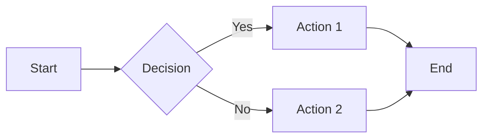
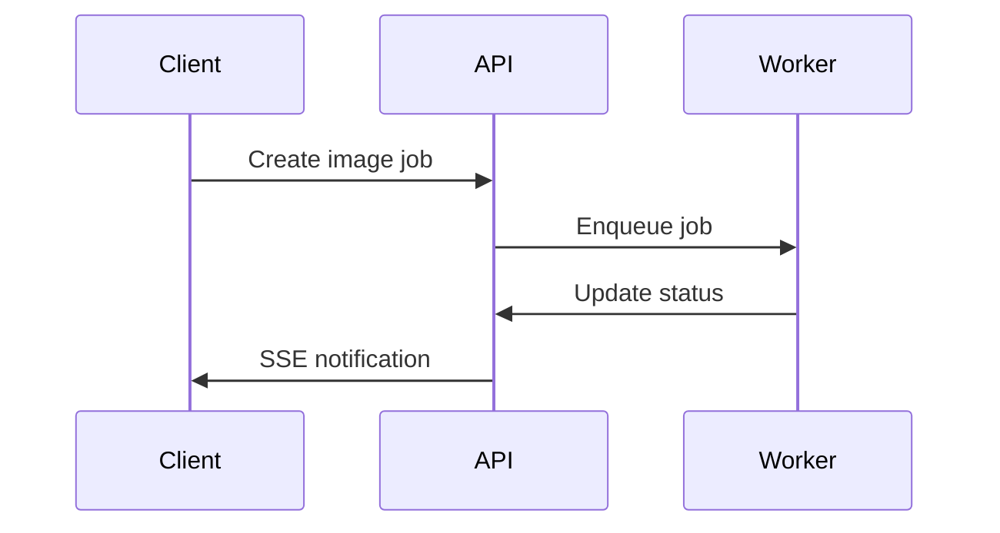
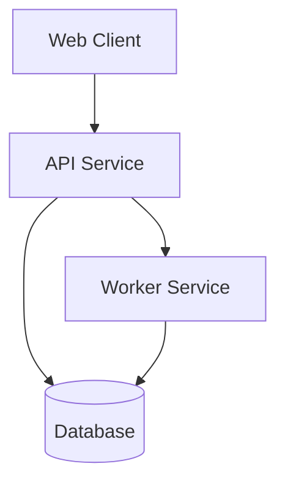

# Documentation Writing Guide

> **For contributors writing Real Staging AI documentation**  
> Maintain consistency and quality across all documentation

---

## Style Guide

### Voice & Tone

- **Be direct and concise** - Get to the point quickly
- **Use active voice** - "The API returns..." not "The response is returned..."
- **Write for clarity** - Assume the reader is competent but unfamiliar with this specific system
- **Be inclusive** - Use "we" when discussing project decisions, "you" when instructing users

### Formatting Standards

#### Headers
```markdown
# Page Title (H1 - Only one per page)

## Major Section (H2)

### Subsection (H3)

#### Minor Section (H4 - Use sparingly)
```

#### Code Blocks
Always specify the language:

````markdown
```bash
make up
```

```go
func Example() {
    // Go code
}
```

```yaml
key: value
```
````

#### Lists
Use `-` for unordered lists (not `*` or `+`):

```markdown
- First item
- Second item
  - Nested item
  - Another nested item
- Third item
```

Use numbers for ordered lists:

```markdown
1. First step
2. Second step
3. Third step
```

#### Emphasis
- **Bold** for important terms, UI elements, or strong emphasis
- *Italic* for gentle emphasis or introducing terms
- `Code font` for filenames, commands, variables, endpoints

#### Links
```markdown
[Link text](./relative-path.md)
[External link](https://example.com)
[Section link](#section-anchor)
```

---

## Document Structure

### Standard Page Template

```markdown
# Page Title

Brief introduction explaining what this page covers (1-2 sentences).

## Overview

More detailed context about the topic (1-2 paragraphs).

## Prerequisites

- List any prerequisites
- Required knowledge
- Required setup

## Main Content

### Subsection 1

Content here...

### Subsection 2

Content here...

## Examples

Provide practical examples with code.

## Troubleshooting

Common issues and solutions.

## Related Documentation

- [Related Doc 1](./link.md)
- [Related Doc 2](./link.md)

---

Next: [Next Logical Step →](./next.md)
```

---

## Content Guidelines

### Writing Clear Instructions

#### ✅ Good Example
```markdown
## Create a Project

Create a new project to organize your images:

1. Log in to the web app at http://localhost:3000
2. Click the **New Project** button in the top right
3. Enter a project name (e.g., "Downtown Condos")
4. Click **Create**

Your project is now ready for image uploads.
```

#### ❌ Bad Example
```markdown
## Projects

You can create projects by going to the web app and clicking the button
to make a new project. Give it a name and then you'll be able to upload
images to it.
```

**Why?** The good example:
- Uses numbered steps for sequential actions
- Specifies exact URLs and UI elements
- Provides concrete examples
- Confirms the expected outcome

### Code Examples

#### Always Include Context

❌ **Bad:**
```go
func CreateProject(name string) Project {
    // ...
}
```

✅ **Good:**
```go
// Create a new project for the authenticated user
func (s *ProjectService) CreateProject(ctx context.Context, name string, userID string) (Project, error) {
    if name == "" {
        return Project{}, ErrInvalidProjectName
    }
    
    project := Project{
        ID:        generateID(),
        Name:      name,
        UserID:    userID,
        CreatedAt: time.Now(),
    }
    
    return s.db.CreateProject(ctx, project)
}
```

#### Provide Full Working Examples

Include necessary imports, error handling, and context:

```go
package main

import (
    "context"
    "log"
    "time"
    
    "github.com/real-staging-ai/api/internal/project"
)

func main() {
    ctx := context.Background()
    
    // Initialize service
    svc := project.NewService(db)
    
    // Create project
    proj, err := svc.CreateProject(ctx, "My Project", "user_123")
    if err != nil {
        log.Fatal(err)
    }
    
    log.Printf("Created project: %s", proj.ID)
}
```

### API Documentation

Follow this structure for API endpoints:

```markdown
### Create Image Job

Create a new image staging job.

**Endpoint:** `POST /api/v1/images`

**Authentication:** Required (Bearer token)

**Request Body:**
```json
{
  "project_id": "01J9XYZ123ABC456DEF789GH",
  "original_url": "s3://bucket/uploads/...",
  "room_type": "living_room",
  "style": "modern"
}
```

**Response (201 Created):**
```json
{
  "id": "01J9XYZ789ABC123DEF456GH",
  "status": "queued",
  "created_at": "2025-10-12T20:30:00Z"
}
```

**Error Responses:**

| Status | Meaning |
|--------|---------|
| 400 | Invalid request body |
| 401 | Authentication required |
| 404 | Project not found |

**Example:**
```bash
curl -X POST http://localhost:8080/api/v1/images \
  -H "Authorization: Bearer $TOKEN" \
  -H "Content-Type: application/json" \
  -d '{
    "project_id": "01J9XYZ123ABC456DEF789GH",
    "original_url": "s3://bucket/uploads/image.jpg",
    "room_type": "living_room",
    "style": "modern"
  }'
```
```

---

## Diagrams

Use Mermaid for diagrams (supported by MkDocs Material):

### Flowcharts

```markdown

```

### Sequence Diagrams

```markdown

```

### Architecture Diagrams

```markdown

```

---

## Special Formatting

### Admonitions

Use MkDocs Material admonitions for special notes:

```markdown
!!! note
    This is a note with default blue styling.

!!! tip "Pro Tip"
    This is a tip with a custom title.

!!! warning
    This is a warning (orange).

!!! danger "Critical"
    This is a danger/error message (red).

!!! info
    This is an info box.

!!! example
    This is an example box.
```

### Tables

```markdown
| Column 1 | Column 2 | Column 3 |
|----------|----------|----------|
| Value A  | Value B  | Value C  |
| Value D  | Value E  | Value F  |
```

Keep tables simple. For complex data, consider a different format.

### Code Annotations

```markdown
```go
func Process(ctx context.Context) error {
    // (1)!
    result, err := doWork()
    if err != nil {
        return err // (2)!
    }
    return nil
}
```

1. This performs the main work
2. Return any errors to the caller
```

---

## Screenshots & Images

### Best Practices

1. **Use high-quality screenshots** (2x resolution for retina displays)
2. **Annotate when helpful** (arrows, highlights, labels)
3. **Crop to relevant area** (remove unnecessary chrome)
4. **Use consistent styling** (same browser, theme, etc.)
5. **Store in `/apps/docs/docs/assets/images/`**

### Adding Images

```markdown


<!-- With caption -->
<figure markdown>
  
  <figcaption>The admin settings interface</figcaption>
</figure>
```

---

## Quality Checklist

Before submitting documentation:

### Content
- [ ] Technically accurate
- [ ] Clear and concise
- [ ] All steps tested and verified
- [ ] Code examples are complete and runnable
- [ ] Links work (no 404s)
- [ ] Terminology consistent with existing docs

### Formatting
- [ ] Proper heading hierarchy (H1 → H2 → H3)
- [ ] Code blocks have language specified
- [ ] Lists use consistent formatting (`-` not `*`)
- [ ] Tables render correctly
- [ ] Images load and are readable

### Structure
- [ ] Page has clear introduction
- [ ] Prerequisites stated upfront
- [ ] Examples included
- [ ] Troubleshooting section (if applicable)
- [ ] Cross-links to related docs
- [ ] Navigation updated in `mkdocs.yml`

### Style
- [ ] Active voice used
- [ ] Jargon explained or avoided
- [ ] Consistent tone throughout
- [ ] No spelling or grammar errors

---

## Common Patterns

### Command Line Instructions

Show the full command with output:

```markdown
Run the health check:

```bash
curl http://localhost:8080/health
```

**Expected output:**
```json
{
  "status": "healthy",
  "timestamp": "2025-10-12T20:30:00Z"
}
```
```

### Configuration Files

Show complete, working configuration:

```markdown
Create `config/prod.yml`:

```yaml
server:
  port: 8080
  host: "0.0.0.0"

database:
  host: "prod-db.example.com"
  port: 5432
  name: "realstaging"
  ssl_mode: "require"

# Full file with all necessary settings
```

Then reference the file:

```bash
export CONFIG_FILE=config/prod.yml
./api
```
```

### Troubleshooting Sections

Use a problem → solution format:

```markdown
## Troubleshooting

### Worker stuck in "queued" status

**Symptom:** Jobs remain in "queued" status and never process.

**Cause:** Worker service is not running or cannot connect to Redis.

**Solution:**
1. Check worker logs:
   ```bash
   docker compose logs worker
   ```

2. Verify Redis is running:
   ```bash
   docker compose ps redis
   ```

3. Restart worker:
   ```bash
   docker compose restart worker
   ```

**Prevention:** Set up monitoring alerts for queue depth.
```

---

## Review Process

1. **Self-review** using the quality checklist above
2. **Test all commands** and code examples
3. **Preview locally** with `make docs-serve`
4. **Get peer review** (optional but recommended)
5. **Submit PR** with conventional commit message

### PR Description Template

```markdown
## Documentation Update

### What Changed
- Added [new page/section] for [feature]
- Updated [existing page] with [information]

### Why
[Explain the gap this fills or problem it solves]

### Checklist
- [ ] All code examples tested
- [ ] Links verified
- [ ] Screenshots added (if applicable)
- [ ] Navigation updated in mkdocs.yml
- [ ] Quality checklist completed
- [ ] Preview locally confirmed

### Preview
[Link to deployed preview, if available]
```

---

## Useful References

- [MkDocs Material Docs](https://squidfunk.github.io/mkdocs-material/)
- [Mermaid Diagram Syntax](https://mermaid.js.org/)
- [Markdown Guide](https://www.markdownguide.org/)
- [Google Developer Documentation Style Guide](https://developers.google.com/style)

---

## Questions?

If you're unsure about documentation standards:

1. Check existing docs for examples
2. Ask in project discussions
3. Reference this guide
4. When in doubt, clarity > style

**Remember:** Good documentation is a gift to future users (and your future self). Take the time to do it right.
