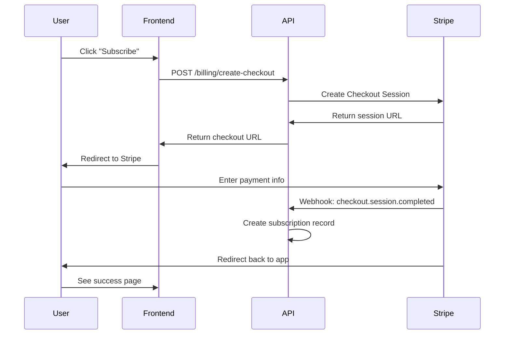

# Stripe Payment Integration Plan

**Feature:** User Profile with Payment Management  
**Priority:** P0 - Critical for Revenue  
**Target:** Week of Oct 14-18 (parallel with documentation work)

---

## Overview

Add user profile page with payment management capabilities to enable subscription and pay-per-use billing.

### What We're Building

1. **User Profile Page** - Display and edit user information
2. **Payment Section** - Manage payment methods and view billing
3. **Subscription Management** - Subscribe, upgrade, cancel plans
4. **Usage Tracking** - View image processing history and costs

---

## How Stripe Payments Work (Explained)

### The Payment Flow



### Key Concepts

#### 1. **Stripe Customer**
- Each user gets a `stripe_customer_id` (stored in `users` table)
- One customer can have multiple payment methods
- One customer can have multiple subscriptions

#### 2. **Checkout Session** (What we'll use)
- Hosted payment page provided by Stripe
- User enters payment info on Stripe's secure site
- Handles 3D Secure, validation, errors automatically
- Redirects back to your app on success/failure

#### 3. **Webhooks** (Already implemented!)
- Stripe sends events to your API when things happen
- `checkout.session.completed` - Payment succeeded
- `invoice.payment_succeeded` - Recurring payment succeeded
- `customer.subscription.updated` - Plan changed
- `customer.subscription.deleted` - Subscription canceled
- Your API stores these in `processed_events` table for idempotency

#### 4. **Subscriptions**
- Recurring billing (monthly, annual, etc.)
- Stored in `subscriptions` table
- Status: `active`, `past_due`, `canceled`, etc.

#### 5. **Payment Methods**
- Credit cards, debit cards, bank accounts
- Stored by Stripe (not in your database for PCI compliance)
- You just reference them by ID

---

## Current State Analysis

### ✅ Already Implemented (Backend)

**Database Schema:**
- ✅ `users.stripe_customer_id` - Links user to Stripe
- ✅ `subscriptions` table - Tracks subscription state
- ✅ `invoices` table - Payment history
- ✅ `processed_events` table - Webhook idempotency

**API Endpoints:**
- ✅ `GET /api/v1/billing/subscriptions` - List user subscriptions
- ✅ `GET /api/v1/billing/invoices` - List user invoices
- ✅ `POST /api/v1/stripe/webhook` - Receive Stripe events

**Stripe Webhook Handling:**
- ✅ Signature verification
- ✅ Idempotent event processing
- ✅ Subscription lifecycle management

### ❌ Missing (What we need to build)

**Backend API Endpoints:**
- [ ] `POST /api/v1/billing/create-checkout` - Start checkout session
- [ ] `POST /api/v1/billing/portal` - Customer portal for managing subscription
- [ ] `GET /api/v1/user/profile` - Get user profile data
- [ ] `PATCH /api/v1/user/profile` - Update user profile

**Frontend Pages:**
- [ ] `/profile` - User profile page with all user info
- [ ] `/profile/billing` - Payment & subscription management (or section on profile page)
- [ ] `/profile/usage` - Usage history and costs

**User Profile Fields:**
Currently, users table only has:
- `id` (UUID)
- `auth0_sub` (authentication ID)
- `stripe_customer_id` (payment ID)
- `role` (user/admin)
- `created_at`

**Missing user info fields:**
- [ ] Full name
- [ ] Email (can get from Auth0, but should cache)
- [ ] Company/business name
- [ ] Phone number
- [ ] Billing address
- [ ] Profile photo URL
- [ ] Preferences (email notifications, etc.)

---

## Implementation Plan

### Phase 1: Extend User Profile (Database)

**New Migration:** `0009_extend_user_profile.up.sql`

```sql
ALTER TABLE users ADD COLUMN IF NOT EXISTS email TEXT;
ALTER TABLE users ADD COLUMN IF NOT EXISTS full_name TEXT;
ALTER TABLE users ADD COLUMN IF NOT EXISTS company_name TEXT;
ALTER TABLE users ADD COLUMN IF NOT EXISTS phone TEXT;
ALTER TABLE users ADD COLUMN IF NOT EXISTS billing_address JSONB;
ALTER TABLE users ADD COLUMN IF NOT EXISTS profile_photo_url TEXT;
ALTER TABLE users ADD COLUMN IF NOT EXISTS preferences JSONB DEFAULT '{}'::jsonb;
ALTER TABLE users ADD COLUMN IF NOT EXISTS updated_at TIMESTAMPTZ NOT NULL DEFAULT now();

CREATE INDEX IF NOT EXISTS idx_users_email ON users(email);
```

**Billing Address Structure (JSONB):**
```json
{
  "line1": "123 Main St",
  "line2": "Suite 100",
  "city": "San Francisco",
  "state": "CA",
  "postal_code": "94102",
  "country": "US"
}
```

**Preferences Structure (JSONB):**
```json
{
  "email_notifications": true,
  "marketing_emails": false,
  "default_room_type": "living_room",
  "default_style": "modern"
}
```

### Phase 2: User Profile API Endpoints

**File:** `apps/api/internal/user/handler.go` (new or extend existing)

```go
// GET /api/v1/user/profile
func (h *UserHandler) GetProfile(c echo.Context) error {
    userID := getUserIDFromContext(c)
    profile, err := h.service.GetUserProfile(ctx, userID)
    if err != nil {
        return echo.NewHTTPError(http.StatusInternalServerError)
    }
    return c.JSON(http.StatusOK, profile)
}

// PATCH /api/v1/user/profile
func (h *UserHandler) UpdateProfile(c echo.Context) error {
    var req UpdateProfileRequest
    if err := c.Bind(&req); err != nil {
        return echo.NewHTTPError(http.StatusBadRequest)
    }
    userID := getUserIDFromContext(c)
    profile, err := h.service.UpdateUserProfile(ctx, userID, req)
    if err != nil {
        return echo.NewHTTPError(http.StatusInternalServerError)
    }
    return c.JSON(http.StatusOK, profile)
}
```

### Phase 3: Stripe Checkout API Endpoints

**File:** `apps/api/internal/billing/checkout_handler.go` (new)

```go
// POST /api/v1/billing/create-checkout
// Creates a Stripe Checkout Session for subscription
func (h *BillingHandler) CreateCheckoutSession(c echo.Context) error {
    var req struct {
        PriceID string `json:"price_id" validate:"required"`
    }
    if err := c.Bind(&req); err != nil {
        return echo.NewHTTPError(http.StatusBadRequest)
    }
    
    userID := getUserIDFromContext(c)
    user, err := h.userService.GetUser(ctx, userID)
    
    // Create or get Stripe customer
    if user.StripeCustomerID == "" {
        customer, err := h.stripeClient.Customers.New(&stripe.CustomerParams{
            Email: stripe.String(user.Email),
            Metadata: map[string]string{
                "user_id": userID,
            },
        })
        user.StripeCustomerID = customer.ID
        // Save to database
    }
    
    // Create checkout session
    params := &stripe.CheckoutSessionParams{
        Customer: stripe.String(user.StripeCustomerID),
        Mode: stripe.String(string(stripe.CheckoutSessionModeSubscription)),
        LineItems: []*stripe.CheckoutSessionLineItemParams{
            {
                Price: stripe.String(req.PriceID),
                Quantity: stripe.Int64(1),
            },
        },
        SuccessURL: stripe.String("https://yourapp.com/profile?checkout=success"),
        CancelURL: stripe.String("https://yourapp.com/profile?checkout=canceled"),
    }
    
    session, err := h.stripeClient.CheckoutSessions.New(params)
    return c.JSON(http.StatusOK, map[string]string{
        "url": session.URL,
    })
}

// POST /api/v1/billing/portal
// Creates a Stripe Customer Portal session for managing subscription
func (h *BillingHandler) CreatePortalSession(c echo.Context) error {
    userID := getUserIDFromContext(c)
    user, err := h.userService.GetUser(ctx, userID)
    
    if user.StripeCustomerID == "" {
        return echo.NewHTTPError(http.StatusBadRequest, "No payment method on file")
    }
    
    params := &stripe.BillingPortalSessionParams{
        Customer: stripe.String(user.StripeCustomerID),
        ReturnURL: stripe.String("https://yourapp.com/profile"),
    }
    
    session, err := h.stripeClient.BillingPortalSessions.New(params)
    return c.JSON(http.StatusOK, map[string]string{
        "url": session.URL,
    })
}
```

### Phase 4: Frontend User Profile Page

**File:** `apps/web/app/profile/page.tsx`

Structure:
```
/profile
├── Personal Information
│   ├── Full Name
│   ├── Email (from Auth0)
│   ├── Phone
│   └── Profile Photo
├── Business Information
│   ├── Company Name
│   └── Billing Address
├── Payment & Billing
│   ├── Current Plan
│   ├── Payment Method
│   ├── Billing History
│   └── Manage Subscription button
└── Preferences
    ├── Email Notifications
    ├── Default Room Type
    └── Default Style
```

---

## Task Breakdown

### Backend Tasks (5-7 days)

#### 1. Database Migration (1 day)
- [ ] Create migration `0009_extend_user_profile.up.sql`
- [ ] Add user profile fields
- [ ] Test migration up/down
- [ ] Update `down` migration

#### 2. User Profile API (2 days)
- [ ] Create `user/profile_service.go`
- [ ] Implement `GetUserProfile`
- [ ] Implement `UpdateUserProfile`
- [ ] Add validation
- [ ] Create handler `user/profile_handler.go`
- [ ] Wire routes in `http/server.go`
- [ ] Write tests

#### 3. Stripe Checkout API (2-3 days)
- [ ] Create `billing/checkout_handler.go`
- [ ] Implement `CreateCheckoutSession`
- [ ] Implement `CreatePortalSession`
- [ ] Add Stripe SDK calls
- [ ] Handle customer creation
- [ ] Wire routes in `http/server.go`
- [ ] Write tests
- [ ] Test with Stripe test mode

#### 4. Update Webhook Handler (1 day)
- [ ] Ensure customer creation events handled
- [ ] Add `customer.created` event handling
- [ ] Test webhook flow end-to-end

### Frontend Tasks (5-7 days)

#### 1. User Profile Page (3 days)
- [x] Create `/app/profile/page.tsx`
- [x] Build Personal Information section
- [x] Build Business Information section
- [x] Build Preferences section
- [x] Add form validation
- [x] Add save/update functionality
- [x] Handle loading and error states
- [x] Add success notifications
- [x] Create user dropdown menu in header
- [x] Fetch and display configured user name
- [x] Mock API route for development (`/api/user/profile`)

#### 2. Payment Section (2-3 days)
- [ ] Install `@stripe/stripe-js`
- [ ] Create Payment & Billing section
- [ ] Display current subscription status
- [ ] Add "Subscribe" button (if no subscription)
- [ ] Add "Manage Subscription" button (redirects to portal)
- [ ] Display billing history table
- [ ] Fetch and display invoices
- [ ] Add download invoice functionality

#### 3. Usage Section (1-2 days)
- [ ] Create Usage tab/section
- [ ] Display image processing history
- [ ] Show cost per image
- [ ] Show total costs
- [ ] Add date range filter
- [ ] Add export functionality

---

## Pricing Plans (Example)

Define your pricing tiers in Stripe Dashboard:

### Free Tier
- **Price:** $0/month
- **Features:**
  - 5 images per month
  - Standard processing
  - Email support

### Pro Tier
- **Price:** $29/month
- **Features:**
  - 100 images per month
  - Priority processing
  - Email + chat support
  - HD downloads

### Business Tier
- **Price:** $99/month
- **Features:**
  - 500 images per month
  - Fastest processing
  - Priority support
  - HD downloads
  - API access

### Pay-As-You-Go
- **Price:** $0.50 per image
- No subscription required

---

## Security Considerations

### ✅ Already Handled
- Stripe webhook signature verification
- Event idempotency
- HTTPS/TLS encryption

### ⚠️ New Considerations
- [ ] Never store credit card numbers in your database
- [ ] Let Stripe handle payment info (use Checkout/Portal)
- [ ] Validate user owns resources before showing billing info
- [ ] Rate limit checkout endpoint to prevent abuse
- [ ] Log all payment events for audit trail

---

## Testing Plan

### Unit Tests
- [ ] User profile service tests
- [ ] Checkout handler tests
- [ ] Profile update validation tests

### Integration Tests
- [ ] Full checkout flow with Stripe test mode
- [ ] Webhook processing
- [ ] Profile CRUD operations

### Manual Testing Checklist
- [ ] Create checkout session
- [ ] Complete payment in test mode
- [ ] Verify webhook received and processed
- [ ] Check subscription appears in profile
- [ ] Test customer portal redirect
- [ ] Update payment method
- [ ] Cancel subscription
- [ ] Verify canceled status updates

---

## Stripe Setup Steps

### 1. Get Stripe Account
- Sign up at https://stripe.com
- Get API keys (test mode and live mode)

### 2. Create Products & Prices
In Stripe Dashboard:
1. Go to Products
2. Create product "Real Staging Pro"
3. Add price "$29/month"
4. Copy the `price_id` (e.g., `price_1ABC123`)

### 3. Configure Webhooks
1. Go to Developers > Webhooks
2. Add endpoint: `https://yourapp.com/api/v1/stripe/webhook`
3. Select events:
   - `checkout.session.completed`
   - `customer.subscription.created`
   - `customer.subscription.updated`
   - `customer.subscription.deleted`
   - `invoice.payment_succeeded`
   - `invoice.payment_failed`
4. Copy webhook signing secret

### 4. Update Environment Variables
```bash
STRIPE_SECRET_KEY=sk_test_...
STRIPE_PUBLISHABLE_KEY=pk_test_...
STRIPE_WEBHOOK_SECRET=whsec_...
```

---

## Next Steps

1. **Review this plan** - Make sure approach makes sense
2. **Create database migration** - Start with extending user table
3. **Build backend APIs** - Profile endpoints, then checkout
4. **Build frontend** - User profile page with sections
5. **Test end-to-end** - Complete a test payment
6. **Deploy** - Ship to production!

---

## Helpful Resources

- [Stripe Checkout Docs](https://stripe.com/docs/payments/checkout)
- [Stripe Customer Portal](https://stripe.com/docs/billing/subscriptions/customer-portal)
- [Stripe Webhooks Guide](https://stripe.com/docs/webhooks)
- [Stripe Testing](https://stripe.com/docs/testing)

---

**Questions?** See the detailed implementation sections above or Stripe's excellent documentation.

**Let's build it!** 🚀
